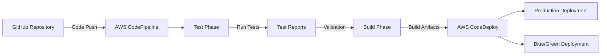

<!-- CSS styling removed - using native GitHub markdown formatting -->

# AWS DevOps Demo Web Application

[](https://github.com/yourusername/aws-devops-demo)

> A demonstration web application showcasing AWS DevOps practices with comprehensive CI/CD pipeline integration using AWS CodePipeline, CodeBuild, and CodeDeploy. Features complete testing suite with Jest for unit and integration testing.

## Quick Reference

| Configuration | Testing | Deployment |
|:-------------:|:-------:|:----------:|
| [buildspec.yml](buildspec.yml) | [testspec.yml](testspec.yml) | [AppSpec](appspec.yml) |
| [Infrastructure](infrastructure.yml) | [Jest Config](jest.config.js) | [Deployment Scripts](scripts/) |
| [Blue-Green Deployment](infrastructure-blue-green.yml) | [Testing in CI/CD](docs/testing-pipeline.md) | [Pipeline Overview](#cicd-pipeline-overview) |

## Overview

This project demonstrates best practices in AWS DevOps implementation, providing a comprehensive example for the AWS DevOps Engineer Professional certification. It includes:

<table>
<tr>
<td width="50%">

### Application Components
- **Frontend**: Interactive web application with HTML, CSS, and JavaScript
- **Testing Framework**: Complete Jest testing suite with unit and integration tests

</td>
<td width="50%">

### CI/CD Components
- **Configuration Files**: 
  - `buildspec.yml` for AWS CodeBuild
  - `appspec.yml` for AWS CodeDeploy
  - Infrastructure as Code (CloudFormation templates)
- **Deployment Strategies**: Including blue-green deployment capability
- **Pipeline Notifications**: SNS integration for build and deployment notifications

</td>
</tr>
</table>

## Project Structure

```
aws-devops-demo/
├── index.html                 # Main HTML file
├── css/
│   └── styles.css             # CSS styles
├── js/
│   └── main.js                # JavaScript functionality
├── images/                    # Image assets
├── tests/                     # Testing directory
│   ├── unit/                  # Unit tests
│   ├── integration/           # Integration tests
│   └── coverage/              # Coverage tests
├── scripts/                   # Deployment scripts for CodeDeploy
├── buildspec.yml              # AWS CodeBuild configuration
├── testspec.yml               # AWS CodeBuild test configuration
├── appspec.yml                # AWS CodeDeploy configuration
├── infrastructure.yml         # Main CloudFormation template
└── docs/                      # Project documentation
```

<details>
  <summary><strong>🔍 View detailed project structure</strong></summary>

```
aws-devops-demo/
├── index.html                 # Main HTML file
├── css/
│   └── styles.css             # CSS styles
├── js/
│   └── main.js                # JavaScript functionality
├── images/                    # Image assets
├── tests/
│   ├── setup.js               # Testing environment configuration
│   ├── coverage.test.js       # Coverage testing utilities
│   ├── complete-coverage.test.js  # Comprehensive coverage tests
│   ├── direct-main.test.js    # Direct function testing
│   ├── mainjs-for-coverage.js # Prepared module for coverage
│   ├── unit/
│   │   └── main.test.js       # Unit tests for JavaScript functions
│   ├── integration/
│   │   ├── app.test.js        # Application flow integration tests
│   │   ├── deployment.test.js # Deployment integration tests
│   │   ├── html.test.js       # HTML structure tests
│   │   └── infrastructure.test.js # Infrastructure tests
│   └── coverage/              # Coverage instrumentation tests
├── scripts/                   # Deployment scripts for CodeDeploy
│   ├── before_install.sh      # Pre-installation setup
│   ├── after_install.sh       # Post-installation configuration
│   ├── start_application.sh   # Application startup
│   ├── stop_application.sh    # Application shutdown
│   ├── validate_service.sh    # Service validation
│   ├── setup-pipeline.ps1     # Pipeline setup automation
│   └── create-pipeline-notifications.ps1 # Notification setup
├── buildspec.yml              # AWS CodeBuild configuration
├── appspec.yml                # AWS CodeDeploy configuration
├── infrastructure.yml         # Main CloudFormation template
├── infrastructure-blue-green.yml # Blue-Green deployment template
├── jest.config.js             # Jest configuration
├── package.json               # Node.js package configuration
├── .gitignore                 # Git exclusion patterns
├── docs/
│   └── testing-pipeline.md    # Testing pipeline documentation
└── README.md                  # Project documentation
```
</details>

## CI/CD Pipeline Overview

This application demonstrates a modern CI/CD pipeline using AWS services with separate testing and building phases:





### Pipeline Stages

<table>
<tr>
<td width="33%">

#### 1️⃣ Source Control
- GitHub repository integration
- Webhook triggers for automated builds
- Code change detection and validation

</td>
<td width="33%">

#### 2️⃣ Test Phase
- AWS CodeBuild using `testspec.yml`
- Runs unit and integration tests
- Generates coverage reports
- Validates code quality
- Produces `test-results.json`

</td>
<td width="33%">

#### 3️⃣ Build Phase
- AWS CodeBuild using `buildspec.yml`
- Verifies test results
- Creates deployment artifacts
- Updates build date and version info
- Prepares for deployment

</td>
</tr>
<tr>
<td>

#### 4️⃣ Reports
- Coverage reports to CodeBuild
- Test results in AWS Console
- Unit and integration test details
- Coverage metrics visualization

</td>
<td colspan="2">

#### 5️⃣ Deployment
- AWS CodeDeploy to EC2 instances
- Configurable with `appspec.yml`
- Lifecycle hooks in `scripts/` directory
- Blue/Green deployment capability
- Automated rollback on failure

</td>
</tr>
</table>

## Testing

The application features a comprehensive testing framework using Jest for both unit and integration tests.

<table>
<tr>
<td width="60%">

### Test Structure
- **Unit Tests**: `tests/unit/` - Tests individual JavaScript functions and modules
- **Integration Tests**: `tests/integration/` - Tests application flow and component integration
- **Coverage Tests**: Various approaches for thorough code coverage reporting
- **Test Setup**: `tests/setup.js` - Configures the test environment with mocks for browser APIs

</td>
<td width="40%">

### Test Coverage

**Current metrics (May 2025):**
- Statement coverage: **90%** ✅
- Branch coverage: **56%** ⚠️
- Function coverage: **84%** ✅
- Line coverage: **90%** ✅

</td>
</tr>
</table>

### Test Types

| Test Type | Purpose | Key Files |
|:----------|:--------|:----------|
| **Unit Tests** | Test individual functions in isolation | `tests/unit/main.test.js` |
| **Integration Tests** | Test application flow | `tests/integration/app.test.js` |
| **DOM Tests** | Test DOM manipulation | `tests/integration/html.test.js` |
| **Infrastructure Tests** | Test infrastructure configuration | `tests/integration/infrastructure.test.js` |
| **Coverage Tests** | Ensure code coverage | `tests/complete-coverage.test.js` |

### Running Tests

```bash
# Install dependencies
npm install

# Run all tests
npm test

# Run tests with coverage report
npm run test:coverage

# Run tests in watch mode (development)
npm run test:watch

# Run specific test files
npm test -- tests/unit/main.test.js
```

Our test suite achieves high code coverage through multiple testing approaches:

- ✅ **Function Testing**: Direct testing of all JavaScript functions
- ✅ **Event Testing**: Simulation of browser events and user interactions
- ✅ **DOM Testing**: Verification of DOM manipulations
- ✅ **Error Handling**: Testing of error conditions and edge cases

## Development & Deployment

### Local Development

```powershell
# Clone the repository
git clone https://github.com/yourusername/aws-devops-demo.git

# Navigate to project directory
cd aws-devops-demo

# Install dependencies
npm install

# Run tests
npm test

# Open in browser (Windows PowerShell)
Start-Process "index.html"
```

### Prerequisites for AWS Deployment

<table>
<tr>
<td width="50%">

- ✅ AWS Account with appropriate permissions
- ✅ AWS CLI installed and configured
- ✅ GitHub account for source control
- ✅ Node.js and npm for local testing

</td>
<td width="50%">


</td>
</tr>
</table>

### Setting Up the AWS CI/CD Pipeline

<details>
<summary><strong>🚀 Option 1: Using CloudFormation</strong></summary>

```powershell
# Deploy the infrastructure
aws cloudformation create-stack --stack-name aws-devops-demo `
  --template-body file://infrastructure.yml `
  --capabilities CAPABILITY_IAM
```

For Blue/Green Deployment:
```powershell
# Deploy blue/green infrastructure
aws cloudformation create-stack --stack-name aws-devops-demo-blue-green `
  --template-body file://infrastructure-blue-green.yml `
  --capabilities CAPABILITY_IAM
```
</details>

<details>
<summary><strong>🖱️ Option 2: Using AWS Console</strong></summary>

1. Navigate to AWS CodePipeline Console
2. Create a new pipeline connecting to your GitHub repository
3. Configure pipeline stages as described below
</details>

<details>
<summary><strong>💻 Option 3: Complete Manual Setup Guide</strong></summary>

For a step-by-step guide on setting up the entire CI/CD pipeline manually:

1. Read our [Manual Pipeline Setup Guide](docs/manual-pipeline-setup.md)
2. This comprehensive guide covers:
   - Creating S3 buckets for artifacts
   - Setting up IAM roles with proper permissions
   - Creating CodeBuild projects for test and build phases
   - Creating the CodePipeline with all required stages
   - Configuring GitHub connections
   - Setting up notifications for pipeline events

> **Note**: The manual setup provides a deeper understanding of how each AWS service is configured to work together in a complete DevOps pipeline.
</details>

## Features

<table>
<tr>
<td width="50%">

### Application Features
- 📊 Interactive counter with milestone messages
- 🔄 Automatic version change detection
- 🔽 Smooth scrolling navigation
- 📅 Build date information display

</td>
<td width="50%">

### DevOps Features
- 🧪 **Comprehensive Testing**: Unit and integration tests with Jest
- 🔄 **CI/CD Pipeline**: Full AWS CodePipeline integration
- 📑 **Infrastructure as Code**: CloudFormation templates
- 🚀 **Multiple Deployment Strategies**: 
  - Standard deployment
  - Blue/Green deployment
- 🔔 **Notification System**: SNS integration for alerts
- ✅ **Build Badges**: Visual status indicators

</td>
</tr>
</table>
## Technical Implementation

<table>
<tr>
<th>Frontend</th>
<th>Testing</th>
<th>CI/CD</th>
<th>Infrastructure</th>
<th>Deployment</th>
</tr>
<tr>
<td>HTML5</td>
<td>Jest</td>
<td>CodeBuild</td>
<td>CloudFormation</td>
<td>AppSpec</td>
</tr>
<tr>
<td>CSS3</td>
<td>jsdom</td>
<td>CodeDeploy</td>
<td>IAM</td>
<td>Lifecycle hooks</td>
</tr>
<tr>
<td>JavaScript</td>
<td>Coverage</td>
<td>CodePipeline</td>
<td>S3</td>
<td>Scripts</td>
</tr>
</table>

## AWS DevOps Professional Certification Topics

This project demonstrates practical implementation of these AWS DevOps Professional certification topics:

<table>
<tr>
<th width="30%">Domain</th>
<th width="70%">Topics Demonstrated</th>
</tr>
<tr>
<td><strong>SDLC Automation</strong></td>
<td>  `CI/CD Pipeline implementation` `Source control integration` `Automated testing`
</td>
</tr>
<tr>
<td><strong>Configuration Management</strong></td>
<td>  `Infrastructure as Code` `CloudFormation templates` `Resource provisioning`
</td>
</tr>
<tr>
<td><strong>Resilience & High Availability</strong></td>
<td>  `Blue/Green deployment` `Automated rollback` `Error handling`
</td>
</tr>
<tr>
<td><strong>Monitoring & Logging</strong></td>
<td>  `Pipeline notifications`
  `Status monitoring`
  `Test reporting`
</td>
</tr>
<tr>
<td><strong>Security & Compliance</strong></td>
<td>  `Secure deployment practices`
  `IAM role configuration`
  `Permission management`
</td>
</tr>
</table>

## License

<table>
<tr>
<td width="70%">

This project is open-source and available for educational purposes under the MIT license.

</td>
<td width="30%">

Copyright © 2025 AWS DevOps Demo

</td>
</tr>
</table>

## Author

Created for AWS DevOps Engineer Professional certification study purposes.

## Notifications & Monitoring

The project includes a comprehensive notification system to keep team members informed about changes to the codebase and pipeline status.

<table>
<tr>
<td width="50%">

### Notification Types

#### GitHub Repository Notifications
- 👀 **Repository Watches**: Team members can watch the repository for changes
- 🔄 **PR and Commit Notifications**: Automatic notifications for code changes
- 📧 **Custom Email Routing**: Configurable email notification rules

#### Pipeline Notifications (AWS SNS)
- 🏗️ **Build Status Alerts**: Notifications for successful/failed builds
- 🚀 **Deployment Status**: Alerts for deployment progress
- ✋ **Approval Requests**: Notifications for manual approval steps

</td>
<td width="50%">

### Setting Up Notifications

#### Manual Setup
To set up pipeline notifications following AWS best practices:

1. Follow the detailed instructions in our [Manual Pipeline Setup Guide](docs/manual-pipeline-setup.md#step-6-set-up-pipeline-notifications)
2. The guide covers:
   - Creating an SNS topic for notifications
   - Setting up email subscriptions for team members
   - Configuring CloudWatch Events rules for pipeline status changes
   - Creating custom notification formats for different event types
   - Setting up specific alerts for test failures

</td>
</tr>
</table>

### Status Monitoring

<table>
<tr>
<td width="33%">

#### Build Badges
- README includes CodeBuild status badge
- Visual indication of build status
- Links to detailed build reports

</td>
<td width="33%">

#### CloudWatch Dashboards
- Pipeline metrics viewable in CloudWatch
- Custom dashboards for key metrics
- Alarm configuration for critical issues

</td>
<td width="33%">

#### CodePipeline Visualization
- Pipeline progress visible in AWS Console
- Stage-by-stage status monitoring
- Historical execution records

</td>
</tr>
</table>

## Additional Resources

<table>
<tr>
<td width="33%">

### Configuration Files
- [buildspec.yml](buildspec.yml): AWS CodeBuild configuration
- [testspec.yml](testspec.yml): AWS CodeBuild test configuration
- [appspec.yml](appspec.yml): AWS CodeDeploy configuration
- [jest.config.js](jest.config.js): Jest testing configuration

</td>
<td width="33%">

### AWS Documentation
- [AWS CodePipeline User Guide](https://docs.aws.amazon.com/codepipeline/latest/userguide/welcome.html)
- [AWS CodeBuild User Guide](https://docs.aws.amazon.com/codebuild/latest/userguide/welcome.html)
- [AWS CodeDeploy User Guide](https://docs.aws.amazon.com/codedeploy/latest/userguide/welcome.html)

</td>
<td width="33%">

### Future Enhancements
- [ ] Integration with AWS X-Ray for distributed tracing
- [ ] Enhanced CloudWatch metrics and alarms
- [ ] Slack/Teams webhook integration for team notifications
- [ ] Automated security scanning in the pipeline
- [ ] Infrastructure testing with CloudFormation Guard

</td>
</tr>
</table>